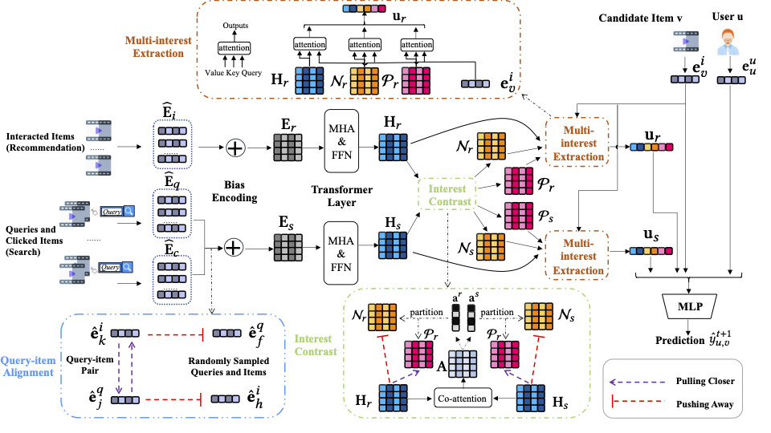

# When Search Meets Recommendation: Learning Disentangled Search Representation for Recommendation
This is the official implementation of the SIGIR 2023 paper "When Search Meets Recommendation: Learning Disentangled Search Representation for Recommendation" based on PyTorch.

\[[arXiv](https://arxiv.org/abs/2305.10822)\]
\[[ACM Digital Library](https://doi.org/10.1145/3539618.3591786)\]

### News:
* [2023.06.29] Recently, we released the first public dataset containing users' real search and recommendation behaviors to facilitate the potential research! You can find the dataset from [https://ethan00si.github.io/KuaiSAR/](https://ethan00si.github.io/KuaiSAR/).


## Overview

The main implementation of SESRec can be found in the file `models/SESRec.py`. 
The architecture of SESRec is shown in the following figure:



## Research Questions

We have concluded some frequently asked questions in the file `FAQ.md`.

## Reproduction
Check the following instructions for reproducing experiments.
### Experimental Setting
All the hyper-parameter settings of SESRec on both datasets can be found in files `config/SESRec_commercial.yaml` and `config/SESRec_amazon.yaml`.
The settings of two datasets can be found in file `config/const.py`.


### Dataset
Since the Kuaishou dataset is a proprietary industrial dataset, here we release the ready-to-use data of the Amazon (Kindle Store) dataset. The ready-to-use data can be downloaded from [link](https://drive.google.com/file/d/1HvdhqzKIRbzjMOlXp9j4Hh5KGvX9oTBw/view?usp=sharing).

### Quick Start
#### 1. Download data
Download and unzip data from this [link](https://drive.google.com/file/d/1HvdhqzKIRbzjMOlXp9j4Hh5KGvX9oTBw/view?usp=sharing). Place data files in the folder `data`.

#### 2. Satisfy the requirements
Our experiments were done with the following python packages:
```
python==3.8.13
torch==1.9.0
numpy==1.23.2
pandas==1.4.4
scikit-learn==1.1.2
tqdm==4.64.0
PyYAML==6.0
```

#### 3. Train and evaluate our model:
Run codes in command line:
```bash
python3 main.py --name SESRec --workspace ./workspace/SESRec --gpu_id 0  --epochs 30 --model SESRec  --batch_size 256 --dataset_name amazon
```

#### 4. Check training and evaluation process:
After training, check log files, for example, `workspace/SESRec/log/default.log`.

### Environments

We conducted the experiments based on the following environments:
* CUDA Version: 11.1
* OS: CentOS Linux release 7.4.1708 (Core)
* GPU: The NVIDIA® T4 GPU
* CPU: Intel(R) Xeon(R) Gold 6230R CPU @ 2.10GHz

### Citation
Please cite our paper if you use this repository.

```
@inproceedings{si2023SESRec,
author = {Si, Zihua and Sun, Zhongxiang and Zhang, Xiao and Xu, Jun and Zang, Xiaoxue and Song, Yang and Gai, Kun and Wen, Ji-Rong},
title = {When Search Meets Recommendation: Learning Disentangled Search Representation for Recommendation},
year = {2023},
isbn = {9781450394086},
publisher = {Association for Computing Machinery},
address = {New York, NY, USA},
url = {https://doi.org/10.1145/3539618.3591786},
doi = {10.1145/3539618.3591786},
booktitle = {Proceedings of the 46th International ACM SIGIR Conference on Research and Development in Information Retrieval},
pages = {1313–1323},
numpages = {11},
keywords = {search, contrastive learning, disentanglement learning, recommendation},
location = {Taipei, Taiwan},
series = {SIGIR '23}
}
```


### Contact
If you have any questions, feel free to contact us through email zihua_si@ruc.edu.cn or GitHub issues. Thanks!
